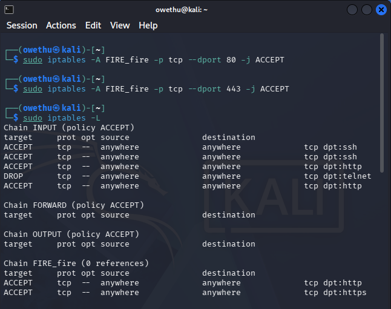
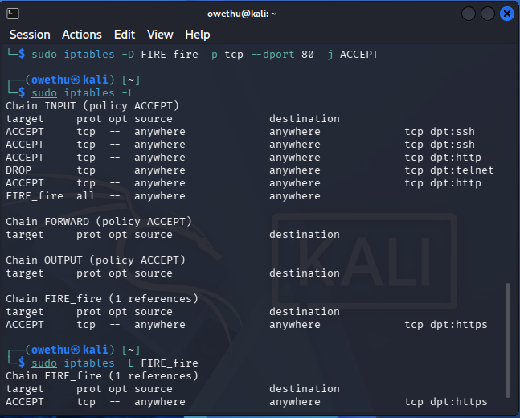
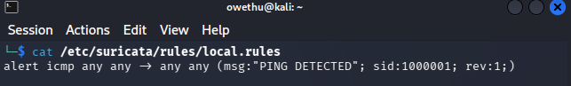
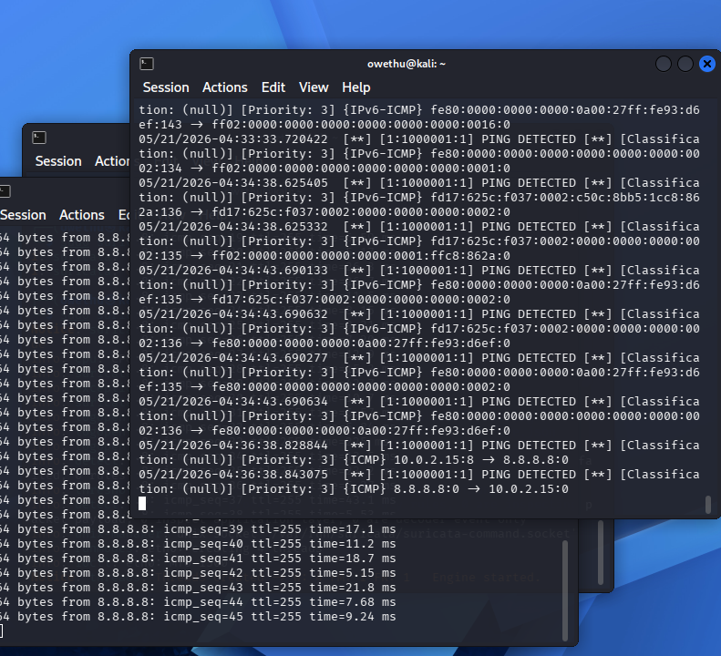
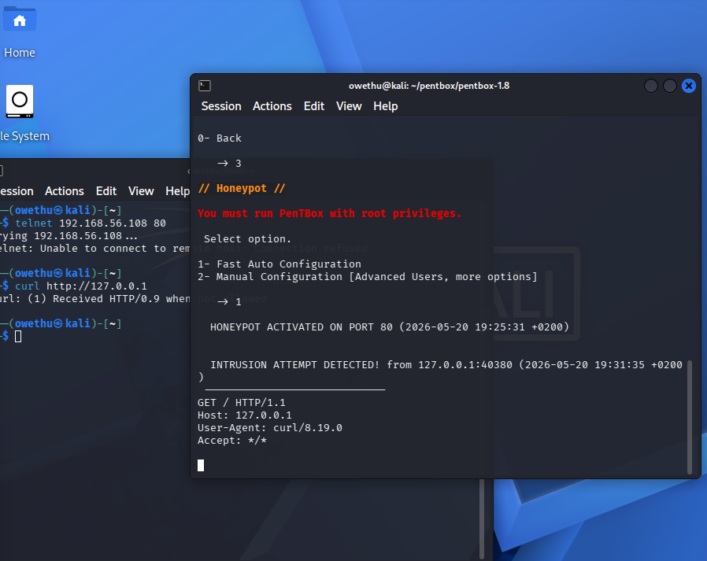
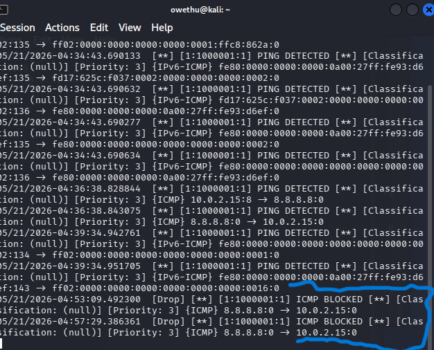
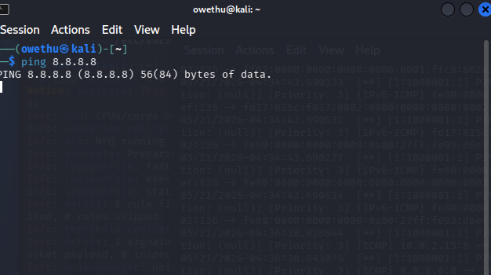

# 🛡️ Cybersecurity Defense Lab (Kali Linux)

## 📌 Overview
This project demonstrates a hands-on cybersecurity defense environment built using Kali Linux.  
It simulates real-world network attacks and defensive mechanisms using firewall rules, intrusion detection systems, and honeypot technology.

The goal is to understand how attackers behave on a network and how security tools detect and prevent intrusions.

---

## 🎯 Objectives
- Configure and test firewall rules using IPTables
- Monitor network traffic and detect intrusions using Suricata IDS
- Simulate attacker interaction using Pentbox Honeypot
- Block unauthorized traffic and validate firewall effectiveness
- Document cybersecurity defense operations

---

## 🧰 Tools & Technologies Used
- Kali Linux
- IPTables (Firewall)
- Suricata (Intrusion Detection System)
- Pentbox (Honeypot)
- Suricata (IPS)
- Linux Terminal
- VirtualBox Shared Folder

---

## 🔥 Firewall Configuration (IPTables)
The firewall was configured to filter and control incoming and outgoing network traffic.

### Evidence:

---

## 🕵️ Intrusion Detection System (Suricata)
Suricata was deployed to monitor network traffic and detect malicious activity.

### Evidence:

---

## 🪤 Honeypot (Pentbox)
Pentbox was used to simulate a vulnerable system to attract and log attacker activity.

### Evidence:

---

## 🚫 IPS / Network Protection
The system demonstrated blocking and prevention of unauthorized network access.

### Evidence:

---

## 📊 Key Learning Outcomes
- Linux-based firewall configuration and rule management
- Real-time intrusion detection and alert analysis
- Honeypot deployment for attacker behavior analysis
- Network traffic monitoring and security enforcement
- Practical cybersecurity defense simulation

---

## 🧠 Conclusion
This project demonstrates practical implementation of core cybersecurity defense mechanisms in a controlled environment.  
It highlights how firewalls, IDS systems, and honeypots work together to detect, analyze, and mitigate network threats.

---

## 👨‍💻 Author
**Busiswa Owethu Zwane**  
Tshwane University of Technology  
Diploma in Information Technology# Cybersecurity Defense Lab

This project demonstrates the implementation of a layered cybersecurity defense system using Kali Linux.

## Technologies Used
- IPTables Firewall
- Suricata IDS/IPS
- Pentbox Honeypot
- VirtualBox

## Features
- Firewall traffic filtering
- Intrusion detection and prevention
- Honeypot attacker monitoring
- Packet inspection and traffic analysis
